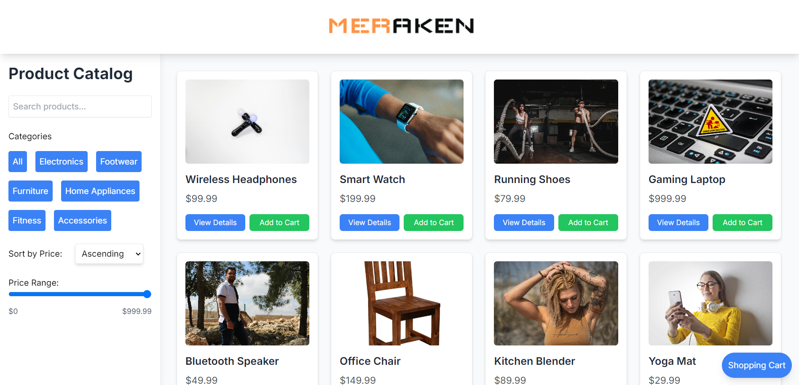
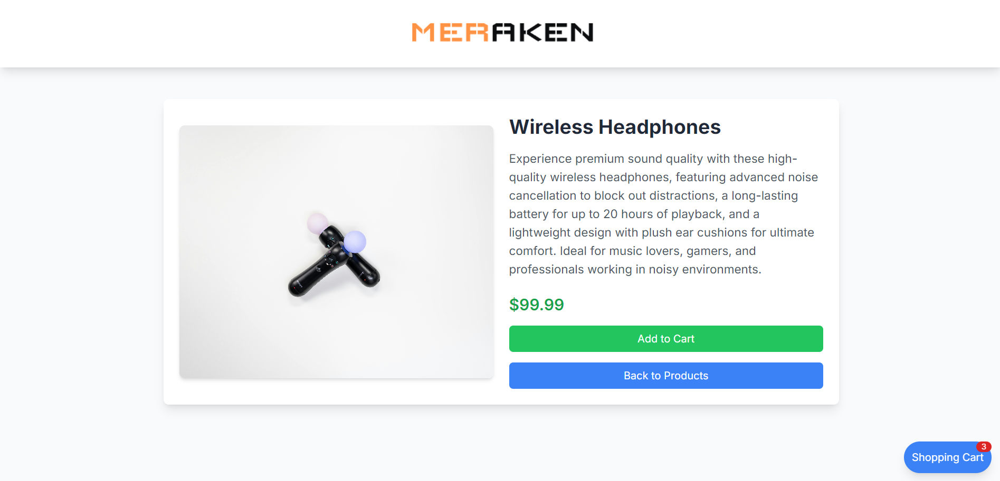
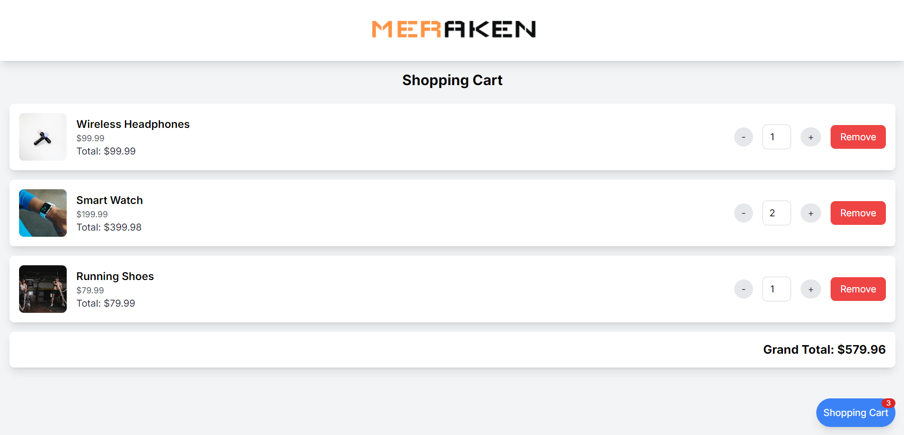
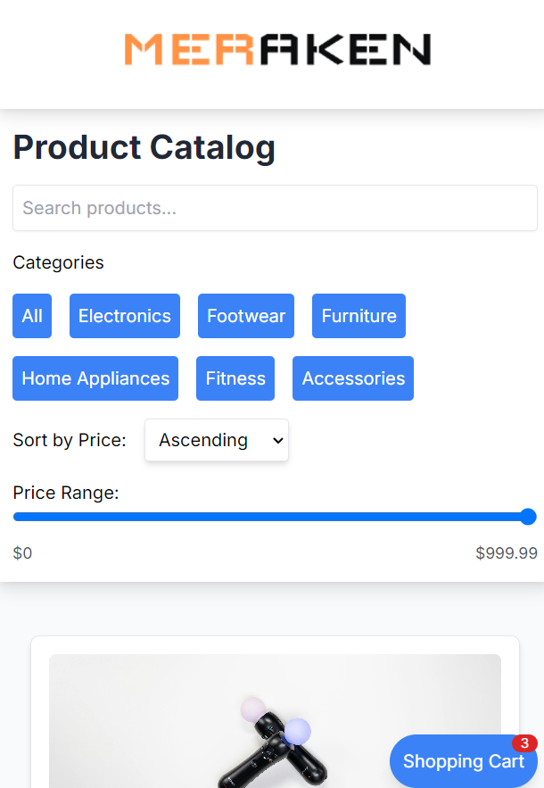

# 🛍️ Product Catalog Application

## 📝 Overview

A dynamic React.js web application that provides an intuitive and responsive product browsing experience. Users can search, filter, and sort products with ease across mobile and desktop platforms.

## 🚀 Features

- **🔍 Product Search**: Quickly find products by name
- **📂 Category Filtering**: Browse products by specific categories
- **💰 Price Sorting**: Sort products by price (ascending/descending)
- **💳 Price Range Slider**: Set budget-based product filters
- **📱 Responsive Design**: Seamless experience on mobile and desktop

## 📸 Application Screenshots

<div style="display: flex; justify-content: space-between; margin-bottom: 20px;">
  
  
</div>

<div style="display: flex; justify-content: space-between; margin-bottom: 20px;">
  
  
</div>

## 🛠️ Tech Stack


- **Frontend**: React.js
- **Styling**: Tailwind CSS
- **Language**: JavaScript (ES6+)

## 🔧 Getting Started

### Prerequisites

- Node.js (v14+)
- npm or yarn

### Installation

1. Clone the repository
   ```bash
   git clone https://github.com/yourusername/product-catalog.git
   ```

2. Install dependencies
   ```bash
   cd product-catalog
   npm install
   ```

3. Run the application
   ```bash
   npm start
   ```

## 🌟 Key Functions

### Product Search
```javascript
const handleSearch = (query) => {
  const updatedProducts = products.filter((p) =>
    p.name.toLowerCase().includes(query.toLowerCase())
  );
  applyFilters(updatedProducts);
};
```

### Category Filter
```javascript
const handleFilter = (category) => {
  setSelectedCategory(category);
  const filteredByCategory =
    category === "All" || !category
      ? products
      : products.filter((p) => p.category === category);
  applyFilters(filteredByCategory);
};
```

## 🚧 Future Enhancements

- Pagination
- User Authentication
- Product Reviews and Ratings

## 📄 License

[MIT License]

## 🤝 Contributing

Contributions are welcome! Please read the contributing guidelines before getting started.

## 👥 Contact

Your Name - partikoffical@gmail.com
